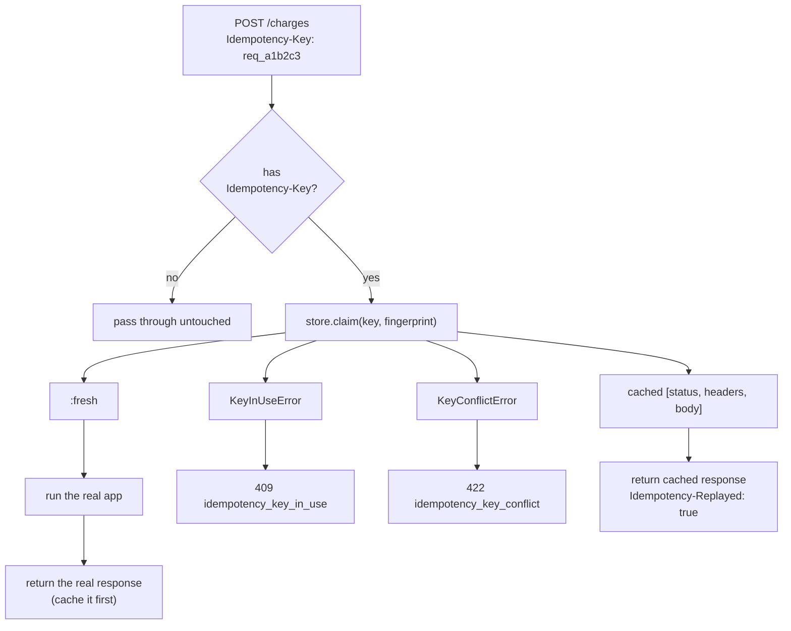

# idempotent_rack

Idempotency-Key middleware for Rack and Rails APIs. A client retry after a
dropped connection (or a double-click, or a naive retry loop) replays the
first request's actual response instead of re-running it - the standard
protection against double-charging a card, double-sending a webhook, or
double-creating a resource. Zero runtime dependencies.

## Why

Most Rack middleware examples handle the *happy path* of idempotency (a
retry with the same key gets the same response) and stop there. Two
things that path leaves open are exactly what this gem is for:

- **A concurrent duplicate** - the client retries *before* the first
  request has finished (a real, common case: a timeout on the client
  side doesn't mean the server stopped processing). Replaying a
  not-yet-existent response is impossible; the right answer is `409`,
  not a second execution of the request.
- **Key reuse with different parameters** - a bug (or a malicious
  client) sends a *different* request under an *already-used* key. Since
  the whole point of the key is "this identifies one specific request,"
  silently accepting that would either replay the wrong response or run
  a request nobody asked to dedupe. The right answer is `422`.

This mirrors [Stripe's documented idempotency-key
semantics](https://docs.stripe.com/api/idempotent_requests) (24-hour
retention, parameter-mismatch detection, cached failures replay too) -
not because Stripe is a spec, but because it's the most-scrutinized real
implementation of this pattern and there's no reason to reinvent worse
edge-case behavior.

## How it works



## Quickstart

```ruby
# config.ru / Rails middleware stack
require "idempotent_rack"
use IdempotentRack::Middleware
```

Real, captured output (`ruby -Ilib` against a plain lambda app - no Rails
needed to see the behavior):

```
First request:
  [app executing for real] body="{\"amount\":4200}"
  -> status=201 replayed=nil body={"charge_id":"ch_599","amount":4200}
Client retries with the SAME key (e.g. connection dropped, naive retry):
  -> status=201 replayed="true" body={"charge_id":"ch_599","amount":4200}
A different request reuses the key with a DIFFERENT body:
  -> status=422 replayed=nil body={"error":{"code":"idempotency_key_conflict","message":"Idempotency-Key \"req_a1b2c3\" was already used with different request parameters"}}
```

Note the retry line has no `[app executing for real]` output before it -
the app genuinely did not run a second time, it's not just returning an
equal-looking response.

## Options

```ruby
use IdempotentRack::Middleware,
  store: IdempotentRack::MemoryStore.new(ttl: 86_400), # default: 24h, matching Stripe's documented window
  methods: %w[POST PUT PATCH],                          # default; GET/DELETE are typically already idempotent
  header_env_key: "HTTP_IDEMPOTENCY_KEY"                 # default Rack env key for the Idempotency-Key header
```

A request with no `Idempotency-Key` header always passes straight
through - this middleware never *requires* clients to send one, it only
acts when they opt in.

## Stores

The middleware talks to a store through a tiny three-method contract
(`claim` / `complete!` / `release!`, documented in
`lib/idempotent_rack/store.rb`). Two are shipped, both zero-dependency:

- **`MemoryStore`** (default) - an in-memory `Hash` + `Mutex`. Full
  protection for a single multi-threaded process (one Puma worker with
  threads); nothing is shared across processes.
- **`FileStore`** - one small JSON file per key in a directory you choose,
  coordinated with advisory `flock`. It survives a process restart and,
  unlike `MemoryStore`, coordinates **multiple processes on one host**
  (several Puma/Unicorn workers sharing a machine):

  ```ruby
  use IdempotentRack::Middleware,
    store: IdempotentRack::FileStore.new(dir: "/var/lib/myapp/idempotency")
  ```

  Single host only: `flock` doesn't coordinate across machines, and network
  filesystems implement it weakly - for multi-host, use a store backed by
  something every host shares (Redis, the database).

Writing your own store? `require "idempotent_rack/store_contract"` and
`include IdempotentRack::StoreContract` in a `Minitest::Test` that defines
`build_store(ttl:)` - you inherit the whole contract as executable tests
(replay, 409-while-in-flight, 422-on-parameter-mismatch, crash-release, TTL
expiry, and exactly-one-concurrent-winner), which are the subtle behaviours
a from-scratch store is most likely to get wrong. It's exactly how
`FileStore` is tested: the same suite as `MemoryStore`, so there's no
parallel hand-written set to drift out of sync.

## Fingerprinting

The fingerprint that detects key-reuse-with-different-parameters is
`SHA256(method + "\n" + path + "\n" + body)`. Two requests with the same
key and the same fingerprint are treated as the same logical request
(replay); a fingerprint mismatch is a `422`, whether it's a different
body on the same path or the same body sent to a different path.

## Honest limitations

- **The shipped `MemoryStore` is per-process.** Two concurrent requests
  with the same key landing on *different* processes (multiple Puma
  workers, multiple hosts) won't see each other and will both execute -
  the in-memory store can't coordinate across process boundaries by
  definition. A single-process, multi-threaded server (the common case
  for a Puma worker with `threads`) gets full protection, verified by a
  real concurrency test (see below). Cross-process protection needs a
  shared store (Redis, the database) implementing `Store`'s contract -
  see `lib/idempotent_rack/store.rb`'s module doc for exactly what that
  requires. The shipped **`FileStore`** already covers the multi-process,
  single-host case with zero dependencies (see "Stores" above); a
  Redis/database-backed store for the multi-*host* case is a roadmap item.
- **Fingerprint is method + path + body, not headers.** Two requests
  that differ only in, say, an `Authorization` header but are otherwise
  identical are treated as the same request. This matches the common
  case (idempotency keys scope a specific *operation*, and who's
  authorized to perform it is usually orthogonal) but is worth knowing.
- **No automatic key expiry sweep.** Expired entries are purged lazily,
  on the next `claim` call for *any* key - there's no background thread.
  For a low-traffic app this means a very stale entry could sit in
  memory a while past its TTL; it will never be served past its TTL
  (every `claim` checks `expires_at` on read), so this is a memory
  footprint concern, not a correctness one.

## Roadmap

- ~~A store contract test suite any custom `Store` implementation can run
  against itself~~ - **shipped in 0.2.0** as `IdempotentRack::StoreContract`
  (see "Stores").
- ~~A store beyond in-memory~~ - **`FileStore` shipped in 0.2.0**
  (persistent, multi-process on a single host).
- A Redis-backed store for cross-*host* guarantees - the `StoreContract`
  above is there to validate it against the same suite the shipped stores pass.
- An ActiveRecord-backed store for Rails apps that would rather not add
  Redis just for this.

## Development

```sh
ruby -Ilib -Itest test/store_test.rb
ruby -Ilib -Itest test/middleware_test.rb
gem build idempotent_rack.gemspec
```

40 tests, 65 assertions, including the shared store contract run against
**both** `MemoryStore` and `FileStore` (each with a real 20-thread race
asserting exactly one claimant wins), FileStore persistence across separate
store instances over one directory, corrupt-file recovery, and a
crash-recovery test (the app raising must release the key so a retry isn't
stuck behind a permanent `409`).

## Related projects by the same author

[`acts_as_mcp`](https://github.com/bharat3645/acts-as-mcp) - the sibling
zero-dependency Rack gem this one's testing style is modeled on.
[`ml-kem-rb`](https://github.com/bharat3645/ml-kem-rb) |
[`mcp-gateway-lite`](https://github.com/bharat3645/mcp-gateway-lite) |
[`modelgate`](https://github.com/bharat3645/modelgate)

## License

MIT
